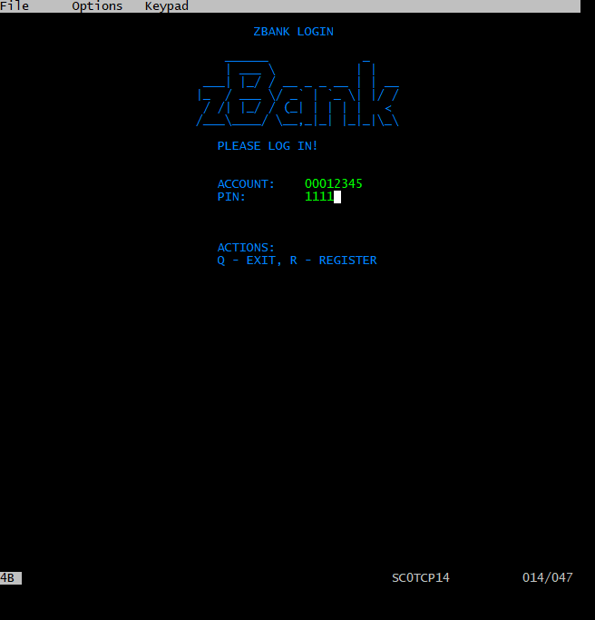
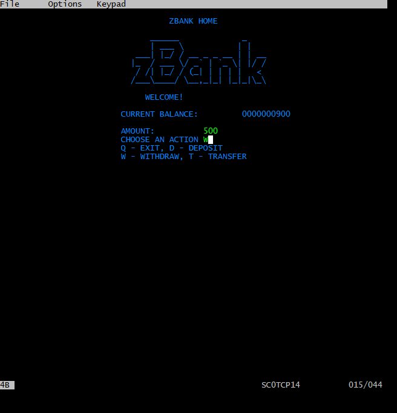
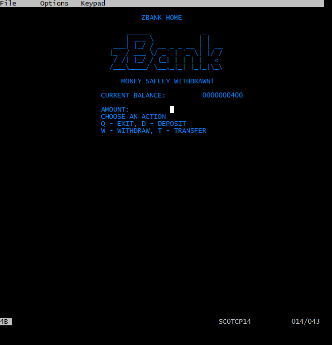
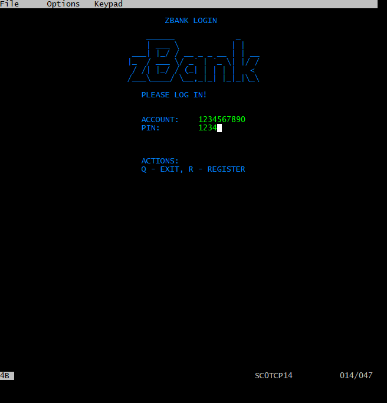

# zBANK
COBOL program to simulate a bank account using VSAM files

COBOL application using\
 CICS, BMS and VSAM\

\
 **An Enterprise Mainframe Computing Project**\

*Authors:*\
Benjamin Linnik\
Nicklas V.\
Henrik G.

For the lecture Enterprise Mainframe Computing a project was developed
in collaboration. The project named “ZBANK” is an application written in
COBOL and uses CICS as a transaction monitor, BMS as a user interface
and a key-sequenced VSAM for data storage. In this document, we
summarize the program code and the work done.

 [fig:zbankSetup]

 [fig:zbank1]

 [fig:zbank2]

 [fig:zbank3]

 [fig:zbank4]
