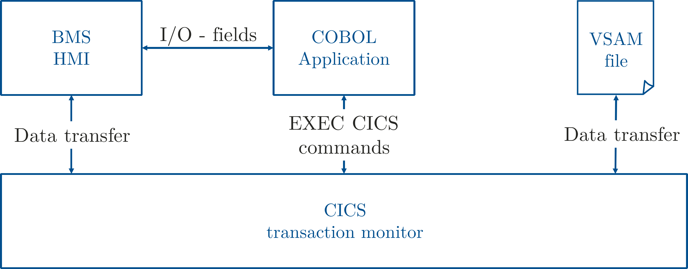

# zBANK
COBOL program to simulate a bank account using VSAM files

COBOL application using\
CICS, BMS and VSAM

 **An Enterprise Mainframe Computing Project**

*Authors:*\
Benjamin Linnik\
Nicklas V.\
Henrik G.

For the lecture Enterprise Mainframe Computing a project was developed
in collaboration. The project named “ZBANK” is an application written in
COBOL and uses CICS as a transaction monitor, BMS as a user interface
and a key-sequenced VSAM for data storage. In this document, we
summarize the program code and the work done.

Schematic sketch of the functional structure of ZBANK

## COBOL Code
see CICS.COB_ZBANK3_.cbl

## JCL CICS Submit Code
CICS.JCL_PPCOMLNK_.cbl \
CICS.JCL_VSAMSET_.cbl \
CICS.JCL_ZMAPSET_.cbl \
CICS.JCL_COPY2VSM_.cbl

## Other files
SEQDAT.ZBANK.cbl

## CICS Installation Code
CICS_install.cbl

Different screens realized with BMS, all the communication is done in
CICS. Data is stored throughout different sessions in a key-sequenced VSAM file

